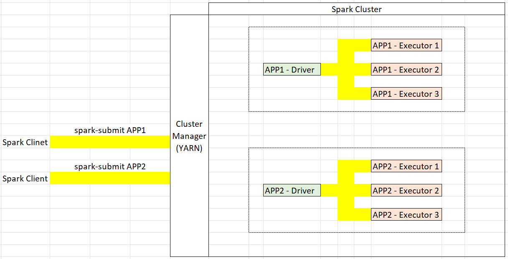

### What is Apache Spark?
A distributed computing platform.

### What do we do with Spark?
We create programs in Spark and execute them on cluster.

### How to execute Spark Programs?
The answer to this is not so simple and straight-forward. We must understand Spark architecture and execution model.

We have two methods run Spark Programs:
- Interactive Clients
- Submit Job

#### Interactive Clients
We have seen command line spark-shell and interactive web-notebooks. Both the methods lets you run the code line-by-line and returns the output. This is used for learning and development phase. 

#### Submit Job
In the production environment we package all the spark code and submit it to the spark cluster for execution. Apache spark comes with a spark-submit utility that allows you to submit the program to the cluster. We have other alternatives, like Databricks allows you to submit notebooks directly. But these are vendor specific. spark-submit is universally accepted method and works every where.

### How Spark Distributed Processing Model Works?
Spark applies a marter-slave architecture to every application. When a application is submitted to the Spark cluster, it creates a Master process for your application. This then creates a bunch of slaves to distrubute the work and get the work done. These Slaves are run-time containers with some dedicated CPU and memory.
In spark terminology, Master is called Driver and the slaves are the Executors. Every Spark application applies the master-slave architecture and runs independently on the cluster. Please note here we are talking about the applications and how they follow master slave architecture and not about the nodes in the cluster. Below is how the architecture looks.

